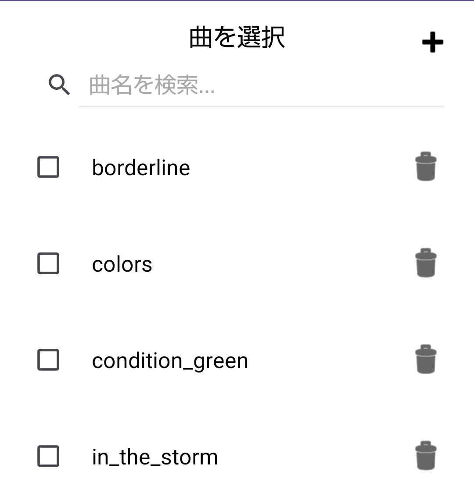
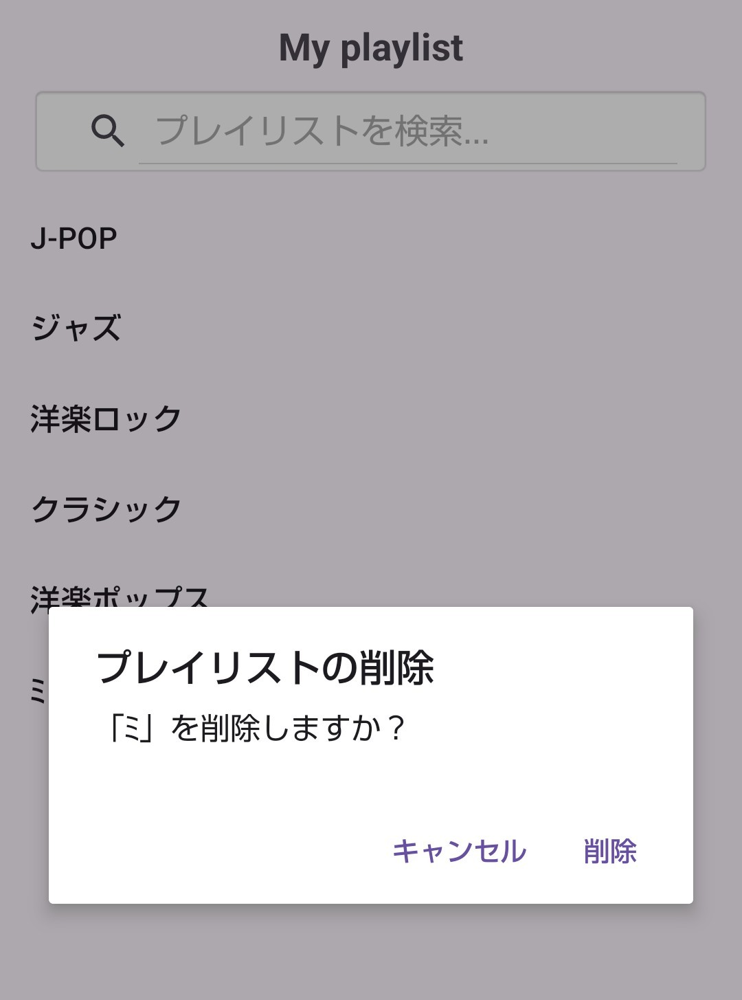

#  Android Music app

端末内のリソース音源だけでなく、外部から取り込んだオーディオファイルで、自分だけのプレイリストを自在に構築出来るリスト型のMP3オーディオプレイヤーです。

# 使用言語

# 製作期間

2か月

## プレイリスト

**複数選択による一括追加**:曲を選択してプレイリストに追加する際に、チェックボックスによる曲の複数選択可能です。

**長押しで削除**:プレイリスト一覧画面で項目を長押しすることで、ダイアログを介して直感的にプレイリストを削除可能です。

## 楽曲管理

**外部からのインポート**:端末のストレージから外部のオーディオファイルを追加インポートする機能を搭載しています。

**連動する削除機能**:アプリ内から楽曲ファイルを削除した場合、その曲が含まれているすべてのプレイリスト内から自動的に該当曲が除外されるようになっています。

## 検索

**文字入力に連動したフィルタリング**:検索欄に文字を入力すると、リストが瞬時にフィルタリングされます。

## 再生コントロール

**プレイリスト連続再生**:プレイリストで選択した曲から再生が始まり、曲が終了すると自動的に次のへスキップします。

**シーク機能と時間同期**:500ミリ秒ごとにシークバーの位置と再生位置.時間ラベル(0:00)表記を同期、ユーザによるシークバー操作にもリアルタイムで追従します。
